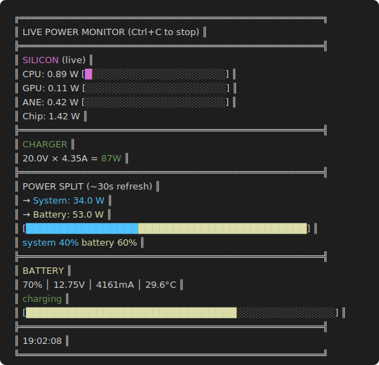

# powermon

Live power monitor for Apple Silicon Macs. Displays real-time CPU, GPU, and ANE power usage alongside battery and charger stats.



## Requirements

- macOS with Apple Silicon
- `sudo` access (required by `powermetrics`)

## Build

```
make
```

## Run

```
sudo ./bin/powermon
```

## What it shows

- **Silicon**: Real-time CPU/GPU/ANE power draw (1s updates via `powermetrics`)
- **Charger**: Voltage, current, and wattage when plugged in
- **Power split**: How charger power divides between system and battery charging
- **Battery**: Percentage, voltage, current, temperature, and charging status
